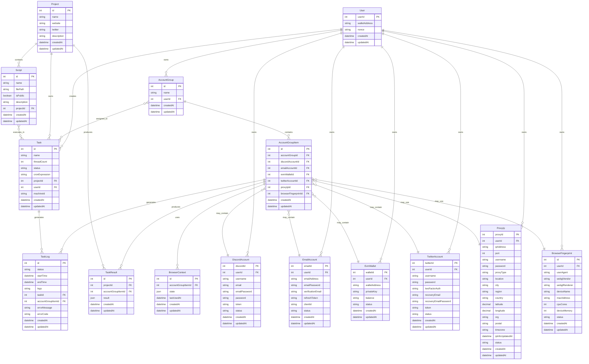

```mermaid
erDiagram
      User {
          int userId PK
          string walletAddress
          string nonce
          datetime createdAt
          datetime updatedAt
      }

      AccountGroup {
          int id PK
          string name
          int userId FK
          datetime createdAt
          datetime updatedAt
      }

      AccountGroupItem {
          int id PK
          int accountGroupId FK
          int discordAccountId FK
          int emailAccountId FK
          int evmWalletId FK
          int twitterAccountId FK
          int proxyIpId FK
          int browserFingerprintId FK
          datetime createdAt
          datetime updatedAt
      }

      Project {
          int id PK
          string name
          string website
          string twitter
          string description
          datetime createdAt
          datetime updatedAt
      }

      Script {
          int id PK
          string name
          string filePath
          boolean isPublic
          string description
          int projectId FK
          datetime createdAt
          datetime updatedAt
      }

      Task {
          int id PK
          string name
          int threadCount
          string status
          string cronExpression
          int projectId FK
          int userId FK
          string machineId
          datetime createdAt
          datetime updatedAt
      }

      TaskLog {
          int id PK
          string status
          datetime startTime
          datetime endTime
          string logs
          int taskId FK
          int accountGroupItemId FK
          string errorMessage
          string errorCode
          datetime createdAt
          datetime updatedAt
      }

      TaskResult {
          int id PK
          int projectId FK
          int accountGroupItemId FK
          json result
          datetime createdAt
          datetime updatedAt
      }

      BrowserContext {
          int id PK
          int accountGroupItemId FK
          json state
          datetime lastUsedAt
          datetime createdAt
          datetime updatedAt
      }

      BrowserFingerprint {
          int id PK
          int userId FK
          string userAgent
          string webglVendor
          string webglRenderer
          string deviceName
          string macAddress
          int cpuCores
          int deviceMemory
          string status
          datetime createdAt
          datetime updatedAt
      }

      ProxyIp {
          int proxyId PK
          int userId FK
          string ipAddress
          int port
          string username
          string password
          string proxyType
          string location
          string city
          string region
          string country
          decimal latitude
          decimal longitude
          string org
          string postal
          string timezone
          datetime ipInfoUpdatedAt
          string status
          datetime createdAt
          datetime updatedAt
      }

      DiscordAccount {
          int discordId PK
          int userId FK
          string username
          string email
          string emailPassword
          string password
          string token
          string status
          datetime createdAt
          datetime updatedAt
      }

      EmailAccount {
          int emailId PK
          int userId FK
          string emailAddress
          string emailPassword
          string verificationEmail
          string refreshToken
          string clientId
          string status
          datetime createdAt
          datetime updatedAt
      }

      EvmWallet {
          int walletId PK
          int userId FK
          string walletAddress
          string privateKey
          string balance
          string status
          datetime createdAt
          datetime updatedAt
      }

      TwitterAccount {
          int twitterId PK
          int userId FK
          string username
          string password
          string twoFactorAuth
          string recoveryEmail
          string recoveryEmailPassword
          string token
          string status
          datetime createdAt
          datetime updatedAt
      }

      %% 关系定义
      User ||--o{ AccountGroup : owns
      User ||--o{ Task : creates
      User ||--o{ DiscordAccount : owns
      User ||--o{ EmailAccount : owns
      User ||--o{ EvmWallet : owns
      User ||--o{ TwitterAccount : owns
      User ||--o{ ProxyIp : owns
      User ||--o{ BrowserFingerprint : owns

      AccountGroup ||--o{ AccountGroupItem : contains
      AccountGroup }o--o{ Task : assigned_to

      AccountGroupItem ||--o{ TaskLog : generates
      AccountGroupItem ||--o{ TaskResult : produces
      AccountGroupItem ||--o{ BrowserContext : uses

      AccountGroupItem }o--|| DiscordAccount : may_contain
      AccountGroupItem }o--|| EmailAccount : may_contain
      AccountGroupItem }o--|| EvmWallet : may_contain
      AccountGroupItem }o--|| TwitterAccount : may_contain
      AccountGroupItem }o--|| ProxyIp : may_use
      AccountGroupItem }o--|| BrowserFingerprint : may_use

      Project ||--o{ Script : contains
      Project ||--o{ Task : owns
      Project ||--o{ TaskResult : produces

      Script }o--o{ Task : executes_in

      Task ||--o{ TaskLog : generates
```